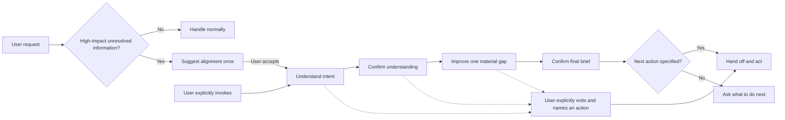

# Align Before Action

`Align Before Action` is a way to talk an idea through before doing anything with it. Use it when the idea is still forming, the context is incomplete, or you do not want the assistant to guess first and act later. Users can invoke it directly, and the assistant may suggest it when a request still has important unresolved details. Once active, it clarifies the goal, fills the key gaps step by step, confirms a shared brief, and acts only after explicit authorization.

[简体中文说明](README.zh-CN.md)

## At a Glance

- Use it when the idea is still forming and clarification matters more than speed.
- Explicit invocation enters alignment immediately.
- Ordinary requests may get one short, optional suggestion when unresolved information could change the outcome.
- While aligned, the assistant asks one material question at a time, improves the idea step by step, and waits for explicit confirmation before acting.
- If the user wants a direct answer or named immediate action, the skill respects that.

## Why It Exists

Most assistant interactions assume the user's first message is complete enough to execute. That fails when the idea is still forming, hidden assumptions matter, or the assistant and user interpret the same words differently.

This skill changes the interaction contract:



It is not a mandatory questionnaire, an autonomous planning agent, or a substitute for normal safety and permission checks.

## Key Behavior

- Explicit invocation enters alignment immediately; implicit selection may only offer a concise, optional suggestion
- A short or colloquial request alone is not treated as vague
- Replies in the user's language
- One answer task per turn
- Questions follow decision dependencies
- A standalone whole-understanding confirmation before improvement
- Local answers confirm only the item currently being discussed
- Discoverable facts are not pushed back to the user
- Progressive help when the user says "I don't know"
- Usually three to five options that cover materially different directions; larger sets are grouped
- One high-impact improvement at a time
- Clear statuses for confirmed, provisional, deferred, and skipped items
- No durable deliverable or state-changing action before confirmation and authorization, unless the user explicitly exits alignment and names the immediate action

## Use It

`Align Before Action` is for situations where the biggest risk is acting too early.

Use it when you want the assistant to:

- understand a rough or unfinished idea first
- ask for the most important missing detail instead of guessing
- help you improve the idea before execution
- keep the conversation short and focused while the goal is still forming

You can invoke the skill directly:

Chinese:

```text
使用 $align-before-action，先通过逐步对话理解并完善我的想法，在我明确确认前不要执行。
```

English:

```text
Use $align-before-action to understand and improve my idea through a step-by-step conversation. Do not take action until I explicitly confirm.
```

Good fits:

- product ideas
- requirements and feature requests
- decisions with multiple possible directions
- writing or wording that needs to be clarified
- personal projects and planning

Not a great fit:

- simple execution requests with enough detail already
- tasks where you want a fast direct answer
- cases where you explicitly want the assistant to skip discussion and act

When you do not invoke it explicitly, the assistant may suggest entering the skill only when important unresolved decisions could make direct handling unreliable. The suggestion is non-blocking: declining it leaves the conversation in normal handling.

### Example Prompts

Direct invocation:

```text
Use $align-before-action to help me clarify this product idea before we plan anything.
Use $align-before-action to check whether this requirement is complete before implementation.
Use $align-before-action to help me compare these career options without deciding for me.
Use $align-before-action to turn this rough thought into a clear, reusable statement.
```

Natural requests that may receive a suggestion:

```text
I have an idea, but I am not sure what problem I am actually trying to solve.
I want to change this workflow, but several directions seem possible.
I need to make an important decision and may be missing a key constraint.
This requirement sounds clear to me, but please check whether direct execution could go wrong.
```

## Install

After cloning or downloading this repository, copy `skills/align-before-action` into your Codex skills directory.

PowerShell:

```powershell
Copy-Item -Recurse -Force .\skills\align-before-action "$env:CODEX_HOME\skills\align-before-action"
```

macOS or Linux:

```bash
cp -R ./skills/align-before-action "$CODEX_HOME/skills/align-before-action"
```

Restart or reload Codex if the skill does not appear immediately.

## Validate

Repository checks require Python 3 and PyYAML:

```bash
python -m pip install pyyaml
python scripts/validate.py
```

Behavioral expectations are documented in [`evals/cases.yaml`](evals/cases.yaml). The packaged skill is intentionally isolated under `skills/align-before-action`; repository documentation and tests are not installed with it.

## Design Notes

The skill keeps a small internal alignment map and selects the highest-impact question that can be answered now. Before it introduces assistant-authored solutions or trade-offs, it presents a standalone whole-understanding checkpoint; local answers cannot silently unlock improvement. When users are unsure, it moves through an assistance ladder: direct question, a covering option set, tentative wording, then a grounded recommendation. Option sets usually contain three to five materially distinct directions and are grouped when the decision space is larger. The improvement stage uses only the most relevant lens instead of dumping a comprehensive checklist.

The user may explicitly stop alignment and request a named immediate action. In that case, the assistant states the most material unresolved risk once, leaves alignment mode, and hands off without disguising the deliverable as another brief.

See [`NOTICE.md`](NOTICE.md) for the open-source projects that informed these mechanisms.

## License

MIT. See [`LICENSE`](LICENSE).
