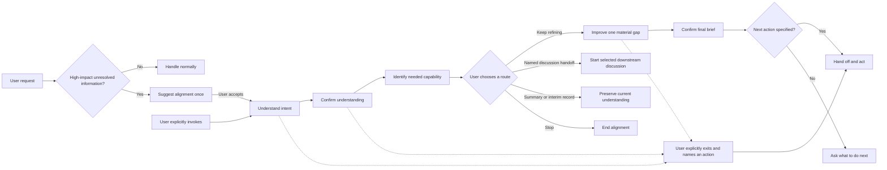

# Align Before Action

`Align Before Action` is a clarification skill for situations where an AI assistant might otherwise act on incomplete or ambiguous intent.

It helps the assistant understand what you mean, identify important gaps, and improve the idea through a focused conversation before moving to a plan, another skill, or an external action.

Use it for developing ideas, making decisions, writing, planning, requests, and everyday situations where different interpretations could lead to different outcomes.

The skill does not take over the user's decisions. It keeps assumptions and suggestions provisional until you confirm them, then recommends the most appropriate next step. Actions that modify files, communicate externally, publish, or deploy still require explicit authorization.

This repository is built as a cross-platform skill pack: the behavior contract is shared, while Codex, Claude Code, and WorkBuddy use their own packaging or loading wrapper. See [harness porting notes](docs/harnesses/README.md) for the platform split.

[简体中文说明](README.zh-CN.md)

## At a Glance

- Use it when the idea is still forming and guided clarification matters more than speed.
- Explicit invocation enters alignment immediately.
- Ordinary requests may get one short, optional suggestion when unresolved information could change the outcome; the skill can automatically detect those candidates from ordinary conversation.
- Automatic loading is not consent: when the user has not invoked or accepted it, the assistant may give a brief reasoned suggestion and offer a rough-judgment alternative, but it must not start alignment or a plan.
- When downstream skills also apply, this skill acts as an upstream gate before their workflows start.
- After understanding is confirmed, the assistant identifies the capability needed next and recommends a matching available skill or a no-skill fallback. `brainstorming`, `grilling`, and `grill-me` are examples, not required dependencies.
- The shared behavior contract can be ported to other hosts, but installation and invocation syntax depend on the host.
- While aligned, the assistant usually advances one material question at a time, but may combine closely related questions when that reduces friction or the user asks for a broader pass.
- It may use a lightweight Socratic question to expose an assumption or trade-off, but it does not turn every turn into a debate or interrogation.
- The assistant can keep responses compact: summary first, then conclusion, then next step.
- Confirming that the assistant understood correctly is not execution approval; it triggers a concise next-step recommendation or a small choice set.
- It may lightly rewrite wording when that helps, but it should not overwrite your voice.
- If the user wants a direct answer or named immediate action, the skill respects that.

## Cross-Platform Support

- Codex is the native packaged path in this repository.
- Claude Code and WorkBuddy use the same behavior contract through host-specific loading or wrapper logic.
- The shared behavior stays the same; only installation, trigger syntax, and auto-discovery differ by host.
- See [harness porting notes](docs/harnesses/README.md) for the platform split.

## Why It Exists

Most assistant interactions assume the user's first message is complete enough to execute. That fails when the idea is still forming, hidden assumptions matter, or the assistant and user interpret the same words differently.

This skill changes the interaction contract:



It is not a mandatory questionnaire, an autonomous planning agent, or a substitute for normal safety and permission checks.

## Key Behavior

- Explicit invocation enters alignment immediately; implicit selection may only offer a concise, optional suggestion
- When used with downstream design or creation skills, it resolves the alignment decision before those workflows begin
- A short or colloquial request alone is not treated as vague
- Replies in the user's language
- One answer task per turn by default; closely related tasks may be combined when that is easier for the user
- Questions follow decision dependencies
- A standalone whole-understanding confirmation before improvement
- After that confirmation, a concise next-step recommendation instead of silent stopping or automatic execution
- Next-step routing starts with the needed capability, then considers available skills and ordinary assistant capabilities
- Missing example skills never block the flow or trigger automatic installation
- Local answers confirm only the item currently being discussed
- Discoverable facts are not pushed back to the user
- Progressive help when the user says "I don't know"
- Clearly requested bounded conversational actions, such as light rewriting or a rough judgment, are completed without a second authorization prompt
- When the user does not know, the assistant may offer a few clearly labeled exploratory hypotheses without turning them into decisions
- The smallest option set that covers materially different directions, often two to four; larger sets are grouped
- One high-impact improvement at a time
- Clear statuses for confirmed, provisional, deferred, and skipped items
- No durable deliverable or state-changing action before confirmation and authorization, unless the user explicitly exits alignment and names the immediate action

## Use It

`Align Before Action` is for situations where the biggest risk is acting too early.

Use it when you want the assistant to:

- understand a rough or unfinished idea first
- ask for the most important missing detail instead of guessing
- help you improve the idea before execution
- keep the conversation short and focused while the goal is still forming
- use a suitable installed skill when its declared purpose matches the next step
- continue without another skill when none is installed or needed
- automatically notice a rough request and suggest alignment once, then wait for your confirmation

You can invoke the skill directly:

Chinese:

```text
使用 $align-before-action，先通过逐步对话理解并完善我的想法，在我明确确认前不要执行。
```

English:

```text
Use $align-before-action to understand and improve my idea through a step-by-step conversation. Do not take action until I explicitly confirm.
```

Good fits:

- product ideas
- requirements and feature requests
- decisions with multiple possible directions
- writing or wording that needs to be clarified
- personal projects and planning

Not a great fit:

- simple execution requests with enough detail already
- tasks where you want a fast direct answer
- cases where you explicitly want the assistant to skip discussion and act

When you do not invoke it explicitly, the assistant may notice unresolved decisions and suggest entering the skill only when direct handling could be unreliable. The suggestion can briefly explain the risk and offer a rough judgment instead; it is non-blocking, so declining it leaves the conversation in normal handling.

### Example Prompts

Direct invocation:

```text
Use $align-before-action to help me clarify this product idea before we plan anything.
Use $align-before-action to check whether this requirement is complete before implementation.
Use $align-before-action to help me compare these career options without deciding for me.
Use $align-before-action to turn this rough thought into a clear, reusable statement.
```

Natural requests that may receive a suggestion:

```text
I have an idea, but I am not sure what problem I am actually trying to solve.
I want to change this workflow, but several directions seem possible.
I need to make an important decision and may be missing a key constraint.
This requirement sounds clear to me, but please check whether direct execution could go wrong.
```

## Install

After cloning or downloading this repository, copy `skills/align-before-action` into your Codex skills directory.

PowerShell:

```powershell
Copy-Item -Recurse -Force .\skills\align-before-action "$env:CODEX_HOME\skills\align-before-action"
```

macOS or Linux:

```bash
cp -R ./skills/align-before-action "$CODEX_HOME/skills/align-before-action"
```

Restart or reload Codex if the skill does not appear immediately.

## Validate

Repository checks require Python 3 and PyYAML:

```bash
python -m pip install pyyaml
python scripts/validate.py
```

Behavioral expectations are documented in [`evals/cases.yaml`](evals/cases.yaml). The packaged skill is intentionally isolated under `skills/align-before-action`; repository documentation and tests are not installed with it.

## Design Notes

The skill keeps a small internal alignment map and selects the highest-impact question that can be answered now. Before it introduces unrequested solution content, it presents a standalone whole-understanding checkpoint; local answers cannot silently unlock improvement. When the user confirms the understanding, the assistant treats that as alignment only, then suggests the best next route or offers a small set of meaningful paths. When users are unsure, it moves through an assistance ladder: direct question, a covering option set only when needed, exploratory hypotheses or tentative wording, then one clearly labeled provisional default or reversible choice. Explicitly requested light actions remain available once their meaning is clear; they do not require a second authorization question unless they would change external state. Option sets use the smallest number of materially distinct directions, often two to four, and are grouped when the decision space is larger. The improvement stage uses only the most relevant lens instead of dumping a comprehensive checklist. Final answers should stay compact: summary, conclusion, next step.

The user may explicitly stop alignment and request a named immediate action. In that case, the assistant states the most material unresolved risk once, leaves alignment mode, and hands off without disguising the deliverable as another brief. For every next step, the assistant first identifies the needed capability, then considers the skills exposed by the current host. A skill is named only when its declared purpose fits and it is known to be available; otherwise the assistant offers to continue without another skill. For example, some environments may use `brainstorming` for design and `grilling` or `grill-me` for stress-testing, but these names are examples rather than dependencies.

When used with downstream skills, `Align Before Action` acts as the upstream gate. Mentioning a domain or skill only makes a downstream workflow potentially relevant. Even after the understanding is confirmed, the assistant first recommends a capability-based route; it does not automatically execute or hand off. A confirmed Final Brief plus an explicit next action authorizes the handoff. Missing skills do not block the conversation, and the skill never installs another skill without an explicit request.

See [`NOTICE.md`](NOTICE.md) for the open-source projects that informed these mechanisms.

## License

MIT. See [`LICENSE`](LICENSE).
