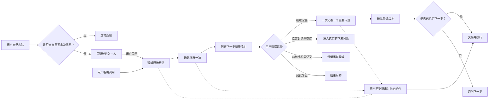

# Align Before Action

`Align Before Action` 是一种行动前的引导式澄清流程。它适合想法还在形成中、上下文不完整，或者你不想让 AI 先猜再做的场景。它不只适合产品和开发，也适合日常决定、写作、表达、请求，或者任何还没想清楚的模糊想法。它以引导式澄清为主，只有在需要发现隐含假设、关键取舍或表达缺口时，才选择性使用轻量苏格拉底式追问。进入后，它会先理解你的原始意图，再和你一起补齐关键缺口、完善想法但不替你接管想法；理解一致后，再由你决定继续完善、交接还是停止，执行仍需明确授权。

这个仓库也按“跨平台公开版”来组织：行为契约是共用的，但 Codex、Claude Code、WorkBuddy 会各自走自己的包装或加载方式。平台说明见 [harness porting notes](docs/harnesses/README.md)。

[English README](README.md)

## 一览

- 适合“想法还在形成中，引导式澄清比快一点更重要”的场景。
- 用户明确调用时，AI 会直接进入对齐。
- 普通输入如果存在可能影响结果的重要未决信息，AI 可以自动发现候选，并先给出一次简短、可拒绝的建议。
- Skill 被自动加载不等于用户同意进入：用户没有明确调用或接受前，可以简短说明为什么建议对齐，也可以提供“先给粗略判断”这样的轻量替代，但不能直接开始对齐或制定方案。
- 当它和其他下游 Skill 同时适用时，它会先作为上游入口 gate。
- 整体理解确认后，AI 会先判断下一步需要什么能力，再推荐匹配的已安装 Skill 或不依赖 Skill 的替代路径。`brainstorming`、`grilling` 和 `grill-me` 只是示例，不是必需依赖。
- 这套行为契约可以迁移到其他 agent；差别主要在安装方式和触发方式。
- 对齐过程中，AI 默认一次推进一个关键问题；如果问题高度相关、用户明确希望一次回答，或合并后更自然，也可以适度合并，但不会变成大段问卷。
- 必要时会用轻量苏格拉底式问题帮助你看见假设或取舍，但不会把每轮都变成辩论或连续盘问。
- 输出可以保持很轻：先总结，再结论 / 下一步。
- 用户确认“你理解得没问题”不等于授权执行；这时 AI 应该给出简短的下一步建议，或提供少量可选路径。
- 需要时可以轻微润色表达，但不会把你的语气完全改掉。
- 如果用户想要直接答案，或者明确要求立刻执行，Skill 会尊重这个选择。

## 跨平台支持

- Codex 是这个仓库里的原生打包路径。
- Claude Code 和 WorkBuddy 通过各自的加载方式或包装层，复用同一套行为契约。
- 行为保持一致；变化主要在安装方式、触发方式和自动发现方式。
- 平台拆分说明见 [harness porting notes](docs/harnesses/README.md)。

## 为什么需要它

常见的 AI 交互默认用户第一次表达已经足够完整，于是 AI 会根据自己的理解直接执行。当想法仍在形成、存在隐含假设，或者双方对同一句话理解不同时，最终结果很容易偏离真实需求。

这个 Skill 会改变交互顺序：



它不是固定问卷，也不是自动替用户做决定的规划工具，更不会绕过正常的安全和权限检查。

## 核心行为

- 用户明确调用时直接进入；普通输入只有在存在重要未决信息时才建议进入
- 和下游设计 / 创建 skill 同时适用时，先处理是否需要对齐，再进入下游流程
- 不会因为输入短、口语化或缺少无关细节就判断为模糊
- 自动使用用户当前的语言回复
- 默认每轮只让用户处理一个回答任务；问题高度相关或用户明确希望一起回答时可以适度合并
- 按问题的依赖关系决定先问什么
- 进入完善前，必须单独进行一次整体理解确认
- 整体理解确认后，先给简短下一步建议，而不是停住、直接执行或自动切到下游 skill
- 推荐下一步时，先判断所需能力，再考虑已安装 Skill 和 AI 自身能力
- 没有安装示例 Skill 时流程不会中断，也不会自动安装
- 局部回答只确认当前事项，不能代替整体确认
- AI 能查明的事实不会反过来要求用户查找
- 用户说“不知道”时逐步降低回答难度
- 用户已经明确提出的轻量对话动作（例如润色一句话、先给粗判断），在意思清楚后直接完成，不重复询问是否授权
- 用户说“不知道”时，可以给少量明确标注为“探索性”的假设或方向，帮助其思考，但不能当成已经决定
- 使用覆盖实质不同方向的最小选项集合，通常为 2～4 个；方向很多时先分组
- 每次只处理一个最重要的完善点
- 明确区分已确认、暂定、延后和跳过的信息
- 最终确认并明确授权前，不生成正式交付物，也不执行会改变外部状态的操作；用户明确退出对齐并指定立即执行的动作时除外

## 调用方式

`Align Before Action` 适合“先理解清楚，再开始执行”的场景。

当你希望 AI 先做这些事时，可以用它：

- 先理解一个还没想完整的想法
- 先抓住最关键的缺失信息，而不是直接猜
- 先帮你把想法补全、理顺，再进入执行
- 在目标还不稳定时，尽量保持对话短而聚焦
- 当已安装 Skill 的用途与下一步匹配时，可以选择交接给它
- 没有安装或不需要其他 Skill 时，也可以由当前 AI 直接继续
- 自动发现一个粗略请求，然后先建议进入对齐，等你确认后再开始

你可以直接调用：

中文默认提示词：

```text
使用 $align-before-action，先通过逐步对话理解并完善我的想法，在我明确确认前不要执行。
```

英文提示词：

```text
Use $align-before-action to understand and improve my idea through a step-by-step conversation. Do not take action until I explicitly confirm.
```

比较适合的场景：

- 产品想法
- 需求 / 功能澄清
- 多个方向之间的选择
- 需要先理顺的写作或表达
- 个人项目和规划

不太适合的场景：

- 信息已经足够、直接执行就行的任务
- 你只想要一个快速结论
- 你明确希望 AI 跳过讨论、直接开始做

如果用户没有明确调用，AI 会先自动判断当前输入是否有重要未决信息；只有在“继续直接处理可能因为关键未决信息而偏离目标”时，才会简短说明风险并建议是否进入对齐模式，也可以提供“先给粗略判断”这样的轻量替代。用户拒绝后可以继续正常对话，AI 不会反复要求进入。

### 示例

直接调用：

```text
使用 $align-before-action，先帮我把这个产品想法梳理清楚，不要马上制定方案。
使用 $align-before-action，帮我检查这个需求是否完整，再考虑开发。
使用 $align-before-action，帮我比较这几个职业方向，但不要替我做决定。
使用 $align-before-action，把这段零散的想法整理成清晰、可以复用的表述。
```

自然表达，AI 可能会建议进入：

```text
我有个想法，但我不确定自己真正想解决的是什么问题。
我想改造现在的流程，但有几个方向都可以做。
我需要做一个重要决定，可能遗漏了关键限制。
这个需求我觉得已经很清楚了，你帮我看看直接执行会不会有偏差。
```

## 安装

克隆或下载仓库后，把 `skills/align-before-action` 复制到 Codex 的 Skills 目录。

PowerShell：

```powershell
Copy-Item -Recurse -Force .\skills\align-before-action "$env:CODEX_HOME\skills\align-before-action"
```

macOS 或 Linux：

```bash
cp -R ./skills/align-before-action "$CODEX_HOME/skills/align-before-action"
```

如果没有立即显示，请重启或重新加载 Codex。

## 验证

仓库校验需要 Python 3 和 PyYAML：

```bash
python -m pip install pyyaml
python scripts/validate.py
```

可复现的行为预期记录在 [`evals/cases.yaml`](evals/cases.yaml) 中。真正安装的 Skill 只位于 `skills/align-before-action`，README、测试和发布文件不会混入 Skill 本体。

## 设计说明

Skill 会在内部维护一份精简的“对齐状态”，优先询问当前能够回答、且最影响结果的问题。在引入未被用户请求的解决方案内容前，它必须单独给出一次整体理解稿；此前的局部回答不能静默解锁完善阶段。用户确认理解一致时，AI 只把它视为“理解已对齐”，随后给出最合适的下一步建议，或提供少量有意义的路径供用户选。用户不知道怎么回答时，AI 会逐级提供帮助：先直接提问，必要时再给覆盖关键方向的选项、探索性假设或暂定说法，最后给出一个可撤销的初始判断。探索性内容必须明确保持暂定，不能静默变成用户的决定。用户已经明确要求的轻量对话动作，在意思清楚后可以直接完成，不需要再次询问授权；涉及写文件、发送、发布或其他外部状态变化时仍需单独授权。选项使用覆盖实质不同方向的最小集合，通常为 2～4 个；更多方向会先分组，再逐步缩小。完善阶段也只采用当前最相关的一个视角，不会一次抛出一长串问题。最终输出尽量保持简洁：先总结，再结论 / 下一步。

用户可以明确停止对齐并指定立即执行的动作。此时 AI 会说明最重要的未解决风险一次，然后退出对齐并交接执行，不会把实际交付物包装成另一份“待确认稿”。对于任何下一步，AI 都先判断需要的是设计、检验、研究、规划、写作还是执行等能力，再查看当前平台公开的可用 Skill。只有某个 Skill 的用途明确匹配且确认可用时，才会点名推荐；否则就提供由当前 AI 直接继续的替代路径。例如，某些环境可以用 `brainstorming` 做设计，用 `grilling` 或 `grill-me` 做压力测试，但它们都只是示例，不是依赖。整体理解确认本身只确认理解，不授权执行；只有确认 Final Brief 并明确下一步动作后，才执行交接。

当它和其他下游 Skill 同时适用时，`Align Before Action` 作为上游入口 gate：先判断是否需要对齐，只建议，不直接进入下游流程。提到某个领域或 Skill 只是说明下游流程可能相关，不是进入授权；整体理解确认后，先根据所需能力推荐路径，用户明确选择后才交接。单独回复“确认”时，只给下一步建议或询问下一步，不自动执行。缺少匹配 Skill 不会中断流程，除非用户明确要求，否则也不会自动安装。

设计借鉴来源与许可证说明见 [`NOTICE.md`](NOTICE.md)。

## 许可证

MIT，详见 [`LICENSE`](LICENSE)。
