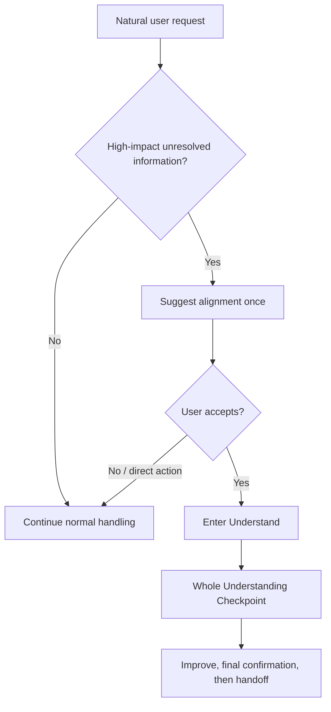

# Implicit Alignment Suggestion Design

> Status: Historical / superseded. This design was implemented and later refined by the current `SKILL.md`, metadata, README files, and behavioral cases.

## Goal

Allow `align-before-action` to be discoverable from ordinary user messages while preserving explicit control over the full alignment workflow.

## Problem

The current skill is manually invoked only. Users who would benefit from alignment may not know the skill exists. The skill should therefore recognize high-impact unresolved information in a natural request and offer alignment, without treating every short or informal message as unclear and without starting a long question sequence automatically.

## Design

Use two entry modes in the same skill:

1. **Explicit mode**: when the user invokes `$align-before-action` or clearly asks to use the skill, enter `Understand` immediately.
2. **Suggestion mode**: when the skill is implicitly selected from an ordinary message, first perform a lightweight sufficiency check. If no unresolved item is likely to change the outcome, continue normally. If one or more high-impact unresolved items exist, send one concise suggestion asking whether to enter alignment. Do not begin the alignment questions in that turn.

The sufficiency check is about decision-relevant uncertainty, not linguistic vagueness. Relevant signals include multiple plausible goals, unresolved audience or scope, contradictory constraints, missing success criteria, or a high-cost/irreversible action whose assumptions are not confirmed. Short, colloquial, or incomplete wording alone is not enough to suggest alignment.

The suggestion is optional and non-blocking. If the user accepts, switch to the existing `Understand` flow. If the user declines, asks for a direct answer, or names an immediate action, honor that choice and do not repeat the suggestion in the same turn. Explicit urgency and safety rules continue to take precedence.

## User-visible flow

## Invariants

- Explicit invocation always wins and skips the suggestion prompt.
- Suggestion mode never creates a brief, plan, file, or external side effect.
- A suggestion is not a judgment that the user's idea is bad or unintelligible.
- The user can decline, defer, or bypass alignment.
- The existing one-answer-task, status tracking, checkpoint, early-exit, and tool-boundary rules remain unchanged after entry.

## Testing

Add observable behavioral cases for:

- Implicitly ambiguous input receives one suggestion.
- Implicitly sufficient input is handled normally without a suggestion.
- User accepts the suggestion and enters `Understand`.
- User declines and the suggestion is not repeated.
- Explicit invocation enters `Understand` directly.
- Explicit named action or urgency is not blocked by the suggestion.
- The assistant does not label an input "vague" solely because it is short or colloquial.

Validate the packaged skill, official skill metadata, and installed copy after implementation. Keep manual whole-understanding and final-handoff scenarios as regression coverage.

## Non-goals

- Do not make every conversation enter alignment automatically.
- Do not infer or commit to user preferences during the sufficiency check.
- Do not add a mandatory domain checklist or minimum conversation length.
- Do not change the downstream execution or safety contract.
