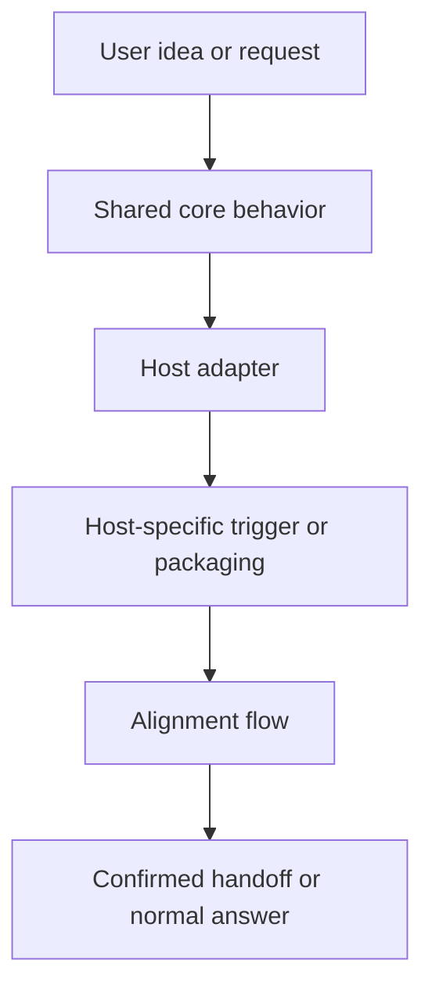

# Cross-Platform Public Packaging Design

> Status: Proposed. This design describes how to present `align-before-action` as a reusable public skill across multiple agent hosts while keeping one shared behavior contract.

## Goal

Make `align-before-action` feel native on multiple agent platforms, not just Codex. A user should be able to install or adapt the same idea across supported hosts and get the same alignment behavior: clarify first, improve second, confirm the shared brief, then act only after authorization.

## Problem

The current repository is Codex-first. Its behavior is already portable in spirit, but the packaging is not yet explicit about other hosts. That creates two risks:

1. People assume the skill only works inside Codex.
2. People assume "support" means identical installation and discovery behavior everywhere, which is not true.

We need a public structure that separates the shared idea from the host-specific wrapper.

## Design

Use a two-layer model:

1. A shared behavior contract for the skill itself.
2. Thin platform adapters that translate that contract into each host's packaging and invocation style.

The shared contract stays platform-neutral. It should describe what the skill does, when it should be suggested, how it handles uncertainty, and when it hands off. It should not depend on Codex-only syntax or imply that every host has the same auto-discovery mechanism.

### Behavior contract

The cross-platform skill keeps these invariants:

- it treats alignment as an upstream gate, not a substitute for normal execution
- it asks one material question at a time
- it can offer concise options, tentative wording, or a reversible provisional default
- it never silently upgrades provisional interpretation into a final decision
- it only hands off to downstream work after the user accepts alignment, declines it, or explicitly names the immediate action
- it supports natural-language disclosure in the user's language where the host allows it

### Platform adapter model

Each host gets a thin wrapper that only handles what that host needs:

| Layer | Responsibility | Stable across hosts? |
|---|---|---|
| Core behavior | The alignment contract, questioning style, and handoff rules | Yes |
| Host adapter | Installation format, metadata, and invocation syntax | No |
| README/Docs | Explain what the skill is, how to install it on each host, and what "support" means | Mostly |

### Repository shape

Keep one public repository with a canonical skill description and separate host-facing adapter folders or files.

Suggested shape:

```text
align-before-action/
  core/
    skill.md
  codex/
    skill package / metadata
  claude-code/
    skill package / metadata
  workbuddy/
    skill package / metadata
  README.md
  README.zh-CN.md
```

If a host only supports plain instruction files, its adapter can be just a short wrapper that points to the shared core text. If a host supports richer metadata, the adapter can add the minimum metadata needed for discovery.

### Invocation model

The canonical idea should be written without assuming Codex syntax. Platform-specific invocation is translated by the adapter:

- Codex can keep `$align-before-action`
- other hosts can expose their own equivalent trigger text or launcher
- manual invocation must always remain available even when auto-discovery differs

### Discovery model

Auto-discovery should be described as best-effort, not guaranteed to behave identically everywhere.

The public README should say:

- supported hosts may suggest the skill automatically when uncertainty is high
- explicit invocation always works where the host supports custom skills
- if a host cannot auto-suggest, the skill still works as a manually invoked alignment tool

### Compatibility promise

Do not promise identical mechanics across hosts. Promise identical intent and near-identical behavior.

That means:

- same user-facing goal
- same alignment flow
- same downstream handoff logic
- different packaging, discovery, and trigger syntax when the host requires it

## User-facing flow



## Success criteria

- A user can understand from the README that this is meant to be cross-platform.
- Codex still works with the current install path.
- Claude Code and WorkBuddy get their own adapter instructions instead of being treated as if they share Codex packaging.
- The core behavior reads the same no matter which host loads it.
- No documentation implies that every host has the same auto-discovery or install mechanism.

## Trade-offs

The main trade-off is maintenance overhead: each host needs a small adapter. The benefit is that the public repo stays honest about platform differences while keeping one consistent skill identity.

## Non-goals

- Do not build a separate product for each host.
- Do not duplicate the full core behavior in every platform folder.
- Do not claim identical trigger syntax across all agents.
- Do not expand the skill into product design or execution skills; keep it as alignment first.

## Validation

Validate this design by checking three things:

1. The core behavior still passes the existing behavioral cases.
2. The public README clearly explains the platform split.
3. Each adapter can be understood without reading another platform's packaging.

